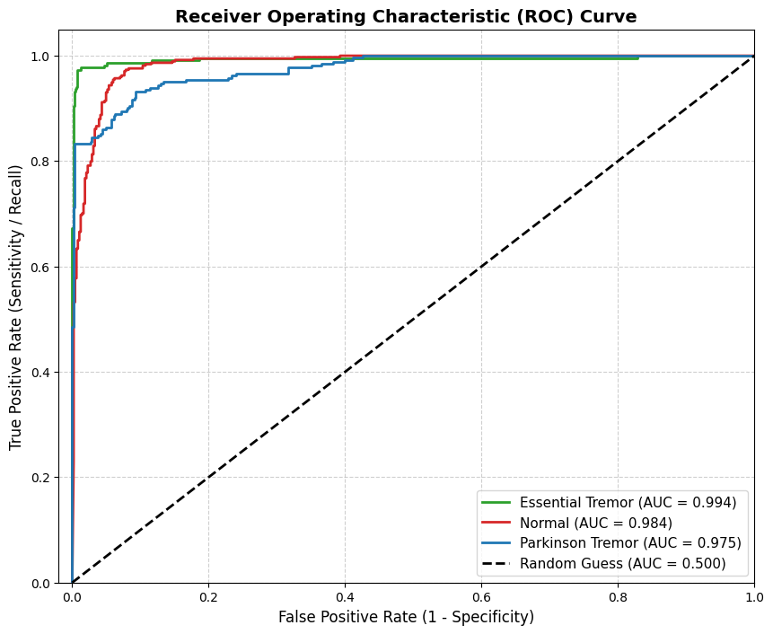
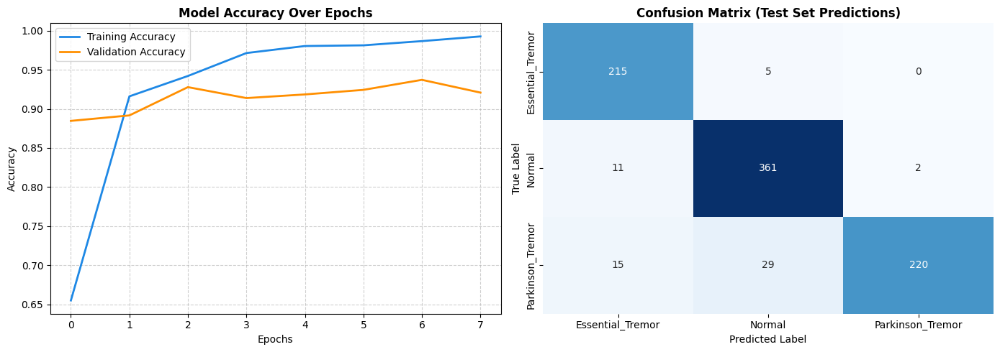
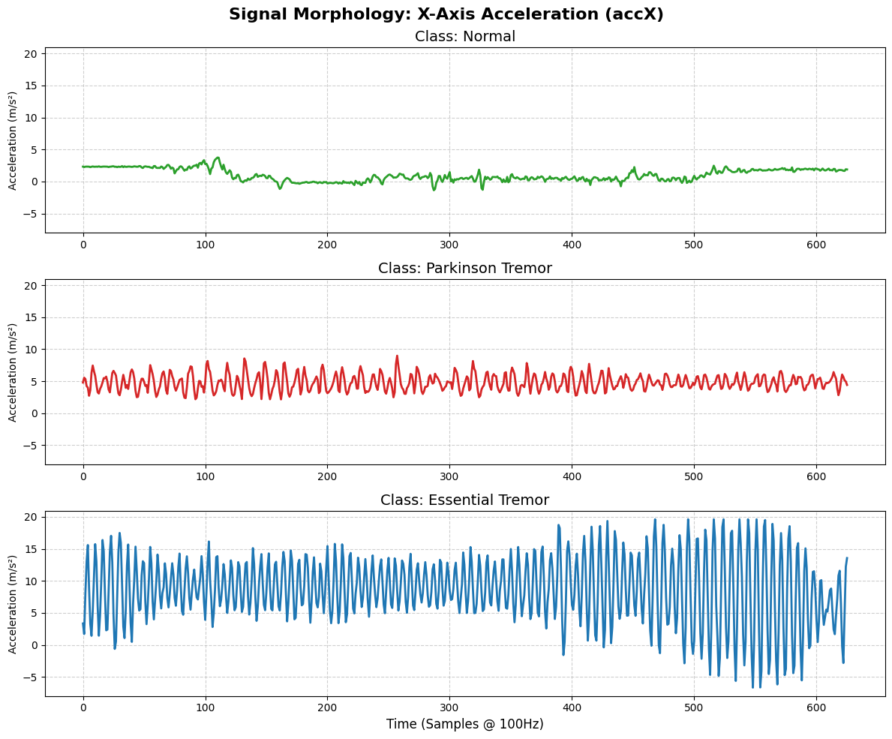

# TremorSense AI: Neurological Tremor Classification at the Edge

## Overview
**TremorSense AI** is an end-to-end Machine Learning pipeline and edge-inference application designed to analyze raw kinematic data (Accelerometer & Gyroscope) and classify neurological tremors in real-time. 

The system differentiates between **Parkinson's Disease (Resting Tremor)**, **Essential Tremor (Action Tremor)**, and **Healthy Baselines**, achieving an overall accuracy of **92.2%**.

This project bridges the gap between hardware IoT sensors and Clinical Data Science, demonstrating robust data engineering, signal processing, and deep learning model deployment.

## Clinical Significance & Diagnostics
A critical aspect of medical AI is minimizing False Positives for severe conditions. As seen in the evaluation metrics, the model achieves near-perfect **Specificity for Parkinson's Disease**. This ensures that healthy individuals or those with benign essential tremors are rarely misclassified as having resting Parkinsonian tremors, making it a reliable screening concept.

<p align="center">
  
  
</p>
*Left: Multiclass ROC Curve showcasing outstanding AUC scores. Right: Training history and Test-Set Confusion Matrix.*

## 🛠️ Architecture & ML Engineering Practices

### 1. 1D-CNN for Time-Series Kinematics
Instead of relying on manual feature extraction (e.g., computing FFTs or spectral entropy), the core engine is a **1-Dimensional Convolutional Neural Network (1D-CNN)**. It automatically learns spatial-temporal hierarchies directly from raw, zero-centered multi-axis sensor data (100Hz windows).

### 2. Preventing Data Leakage (The `GroupShuffleSplit` approach)
When working with sliding windows in time-series data, random train/test splits cause severe data leakage (adjacent overlapping windows from the same patient end up in both sets). 
To ensure scientific validity, I utilized `GroupShuffleSplit` based on a unique `File_ID`. **This guarantees that the model is tested on entirely unseen physical recording sessions, representing true generalization.**

### 3. Signal Morphology
The model ingests 6 Degrees of Freedom (3-axis Acc, 3-axis Gyr). Below is a visual representation of how the AI "sees" the differences in X-axis acceleration across pathologies:

<p align="center">
  
</p>

## Interactive Streamlit Dashboard
To prove the model's operational readiness, I developed a Streamlit UI that acts as the digital twin of a medical interface.

**Modes of Operation:**
1. **🔌 Edge IoT Mode (Live USB):** Connect an Arduino Nano 33 BLE via serial port. The app buffers 100-sample windows, applies zero-centering, and feeds the `keras` model for live inference.
2. **☁️ Cloud Demo (Playback):** Don't have the hardware? Select a pathology from the sidebar to stream 60 seconds of historical test data through the AI, simulating a live environment. Includes an exponential moving average (deque buffer) to stabilize UI predictions.

## How to Run Locally

1. Clone the repository
```bash
   git clone [https://github.com/thanosgkamplias/TremorSense-AI.git](https://github.com/thanosgkamplias/TremorSense-AI.git)
   cd TremorSense-AI

2. Install Dependencies:
```bash
   pip install -r requirements.txt

3. Launch the Real-time Dashboard:
```bash
   cd src
   streamlit run app.py

Dataset Note
The tremor_dataset.csv contains ~120,000 instances of IMU data. It has been pre-compiled from raw .cbor files generated during data collection sessions.
